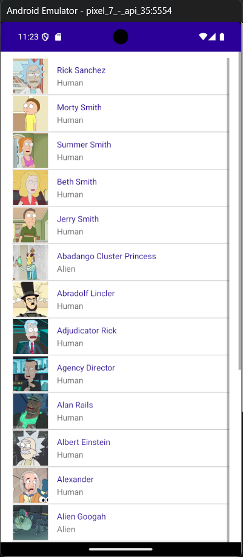

# Rick and Morty App - DEMO

Este es un ejemplo de una aplicación desarrollada en .NET MAUI donde se consume la API [rickandmortyapi.com/api/](https://rickandmortyapi.com/api/character) para mostrar en un listado los personajes de la serie antes mencionada y tiene como finalidad el servir de guia para que los desarrolladores nuevos aprendan con un ejemplo sencillo.
Favor de apoyar el repositorio oficial.

## ScreenShots

